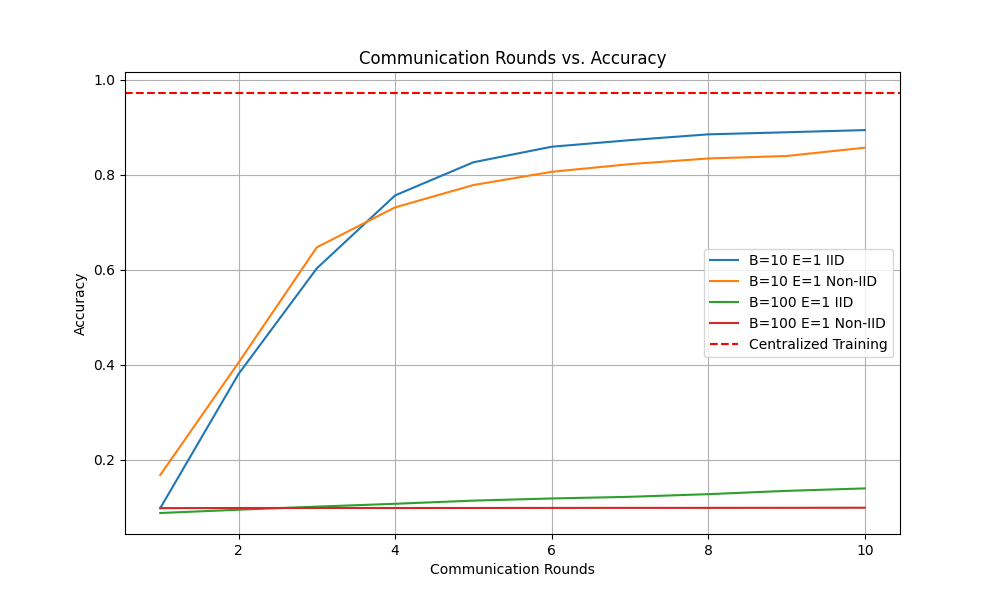

## Comparison between centralized training vs. FedAvg with 100 Clients

A toy code to conduct the experiment for the paper [Communication-Efficient Learning of Deep Networks from Decentralized Data](https://arxiv.org/pdf/1602.05629) using [Flower](https://flower.ai/) framework with MNIST dataset.

`./run.py` will generate an `eval` folder to store all the results and figures.

For the current configuration, it simulates 100 clients using both IID and Non-IID data with the FedAvg algorithm under various training settings, yielding the following results. The comparison figure below is conducted on the Apple M1 Pro Chip with 32GB memory. 



All the `*.json` files specify various training parameters. For instance, in `config_B100_E1_non_iid.json`, as shown below, we can configure these parameters for each evaluation. The following configuration will spawn 100 Flower clients and 1 server process. Each client runs local training with their own Non-IID local dataset with 1 epoch and 100 mini-batch sizes. Afterward, the local parameter of the model will be sent back to the server as 1 communication round. This configuration will run 10 communication rounds.
```
{
    "description": "B=100 E=1 Non-IID",
    "device": "mps",
    "epochs": 1,
    "batchsize": 100,
    "log_interval": 10,
    "num_clients": 100,
    "num_shards": 200,
    "non_iid": true,
    "num_rounds": 10
}
```

To compare the `Accuracy vs Communication Round` with different evolution:
1. define different `.json` file you want to compare
2. add the all the `.json` you want to compare in `all_configs` list in the `run.py` 
3. `./run.py`


## Data Distribution
**IID**: The data is randomly distributed to all the clients


**Non-IID**: The data is sorted based on the target label and split into different shards with each shard size 200. The nature of sorted data makes data within the same shard are Non-IID. The shards are distributed randomly to all the clients.


### File structure
``` bash
.
├── centralized.json
├── config_B100_E1_iid.json
├── config_B100_E1_non_iid.json
├── config_B10_E1_iid.json
├── config_B10_E1_non_iid.json
├── eval1720210884 # Result folder, log, and figured after executing run.py
├── client.py # Flower client code
├── mnist.py # Centralized training code
├── requirements.txt
├── run.py # Evaluation starter code. 
├── server.py # Flower server code
```
